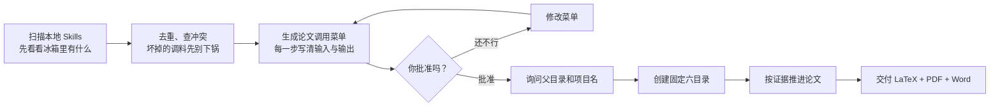

<div align="center">

# 🍱 Paper Menu

### 先看菜单，再点技能，最后上论文。

一个不让 AI 一上来就乱建文件夹、乱写“显著提升”、乱炖全部 Skills 的科研论文总控 Skill。

</div>

> 论文不是自助餐：本地装了 80 个 Skill，不代表每个都要舀一勺。

`paper-menu` 会先盘点你本地已经安装的科研 Skills，分析重复、冲突、缺口和适用阶段，给出一份完整的调用菜单。你点头以后，它才会询问项目放在哪里、文件夹叫什么，然后创建固定目录并开始干活。

换句话说：**先讨论怎么做，再问项目住哪儿。不会刚见面就搬你家。**

## 30 秒看懂它



它主要解决四个问题：

1. **Skill 太多，不知道先用谁。**先盘点，再排序，不靠感觉抓阄。
2. **不同 Skill 容易互相打架。**同名版本、能力重叠和外部副作用都会列出来。
3. **论文文件越做越像杂物间。**固定六目录，代码、图、表按结果编号归位。
4. **草稿很容易被叫成“最终版”。**没有通过引用、结果和交付审计，就不能提前敲锣打鼓。

## 安装

### Windows PowerShell

```powershell
$skillsRoot = if ($env:CODEX_HOME) { Join-Path $env:CODEX_HOME 'skills' } else { Join-Path $env:USERPROFILE '.codex\skills' }
New-Item -ItemType Directory -Force -Path $skillsRoot | Out-Null
git clone https://github.com/siyunhao2025-beep/paper-menu.git (Join-Path $skillsRoot 'paper-menu')
```

### macOS / Linux

```bash
SKILLS_ROOT="${CODEX_HOME:-$HOME/.codex}/skills"
mkdir -p "$SKILLS_ROOT"
git clone https://github.com/siyunhao2025-beep/paper-menu.git "$SKILLS_ROOT/paper-menu"
```

安装后，重新打开 Codex 或刷新 Skills 列表。若目标目录已经存在，先确认它是不是旧版本；不要用一条覆盖命令把自己的修改顺手扬了。

你也可以下载仓库 ZIP，解压后把整个文件夹放入 Codex 的 Skills 目录。关键检查点是：

```text
<Skills目录>/paper-menu/SKILL.md
```

只复制 `SKILL.md` 不够，`scripts/` 和 `references/` 也得一起带上。只带菜单、不带厨房，多少有点为难厨师。

## 第一次怎么用

在 Codex 中发送：

```text
使用 $paper-menu 帮我从零启动一篇关于“XXXXX”的科研论文。
请先盘点我本地所有科研论文相关 Skills，检查重复、冲突和能力缺口，
然后给出完整的调用顺序、每一步的输入输出和风险。
在我批准之前，不要创建项目文件夹。
```

`paper-menu` 的第一次回复应该包含：

- 扫描了哪些 Skill 位置；
- 找到多少个 Skills；
- 哪些与科研论文相关；
- 哪些同名、重复或存在版本冲突；
- 每个论文阶段准备使用哪个主 Skill；
- 哪些 Skill 被排除，以及为什么；
- 哪些环节需要联网、账号、外部写入或较长计算时间；
- 一句明确的问题：**是否批准这份调用菜单？**

这时它还不会创建文件夹。是的，它忍住了。

## 批准以后会发生什么

如果菜单没问题，回复：

```text
我批准这个调用顺序，请继续。
```

然后 `paper-menu` 才会询问两件事：

1. 新科研项目的父目录在哪里；
2. 新项目文件夹叫什么名字。

例如：

```text
父目录：D:\科研项目
项目名：城市热岛预测
```

它会先预演目标路径，确认不会覆盖旧目录，再创建：

```text
城市热岛预测/
├── .paper-menu.json
├── 1_数据/
├── 2_代码/
├── 3_图片/
├── 4_表格/
├── 5_参考文献/
└── 6_最终Latex代码+PDF+Word/
    └── 0_论文执行台账.md
```

六个业务目录固定不动。某个专业 Skill 如果想另起一套“我有自己的想法”目录，`paper-menu` 会先尝试映射；实在映射不了，必须回来找你批准。

## 代码、图片、表格怎么编号

同一个研究结果，在代码、图片和表格之间共享编号：

```text
2_代码/1_得到描述性统计结果.py
3_图片/1_得到描述性统计结果.png
4_表格/1_得到描述性统计结果.xlsx

2_代码/2_得到处理效应估计结果.R
3_图片/2_得到处理效应估计结果.pdf
4_表格/2_得到处理效应估计结果.csv
```

这样看到图 2，就能顺藤摸瓜找到代码 2 和表格 2。论文出了问题，不必在 `final_v2_真的最终版_这次不改了.py` 里考古。

结果标签必须保持中性：

- ✅ `得到处理效应估计结果`
- ❌ `得到处理显著提升结果`

还没计算，就别先替结果庆功。统计学可能会记仇。

## 它会怎样安排一篇论文

实际流程会根据你安装的 Skills、论文类型、已有材料和目标期刊动态调整，通常覆盖：

1. 研究问题与证据边界；
2. 文献发现、筛选和引用核验；
3. 数据与材料审计；
4. 研究设计和分析计划；
5. 建模、实验或理论推导；
6. 统计诊断和稳健性分析；
7. 科研图片和表格；
8. 论文结构与初稿；
9. 主张—证据和引用完整性审计；
10. 同行评审式检查与修订；
11. 期刊格式和语言适配；
12. LaTeX、PDF、Word 编译与交付审计。

每个阶段只选择一个主 Skill。需要时可以增加一个辅助或备用 Skill，但不会把五个写作 Skill 同时请进来抢方向盘。

## 最终会交付什么

最终目录至少需要：

```text
6_最终Latex代码+PDF+Word/
├── 0_论文执行台账.md
├── 1_论文正文.tex
├── 2_论文正文.pdf
└── 3_论文正文.docx
```

只有文件存在还不算完成。最终审计还会检查：

- 六个固定目录是否完整；
- 代码、图、表是否符合编号契约；
- 登记路径有没有跑出项目目录；
- 结果编号是否连续，标签是否一致；
- 参考文献记录是否存在；
- LaTeX 是否具备基本文档结构；
- PDF 是否是可识别的 PDF 文件；
- Word 是否具备有效的文档结构；
- PDF 和 Word 是否比最终 LaTeX 源更旧；
- 未解决的研究限制是否已明确披露。

真正的 LaTeX 编译、PDF 视觉检查和 Word 语义一致性仍需实际工具验证。改个扩展名不叫格式转换，那叫文件乔装。

## 常见问题

<details>
<summary><strong>它会把我安装的所有 Skills 都执行一遍吗？</strong></summary>

不会。它会枚举全部 Skills，完整分析科研论文相关候选，但只调用对当前论文有明确价值的最小集合。其余 Skills 会列出排除原因。

把全部 Skills 都跑一遍，不叫充分利用资源，叫技能自助餐失控。

</details>

<details>
<summary><strong>没有数据，也能直接写出一篇有显著结果的论文吗？</strong></summary>

不能。缺少数据、实验或可核验证据时，它只能报告缺口、调整论文类型，或帮助制定获取材料的方案。它不会凭空制造显著性、DOI、样本量和审稿意见。

魔术归魔术，科研归科研。

</details>

<details>
<summary><strong>为什么非要先批准菜单？不能一键全自动吗？</strong></summary>

研究问题、数据边界、外部数据库、计算成本和目标期刊都会改变工作流。先看菜单，可以避免做到第八步才发现第一步理解错了。

论文不是抽盲盒，尤其不建议拿毕业时间抽。

</details>

<details>
<summary><strong>它会覆盖我已有的项目吗？</strong></summary>

默认不会。创建脚本发现目标目录已经存在时会直接停止。若要迁移旧项目，应先明确提出迁移需求并审计现有文件，而不是让新框架骑着压路机进场。

</details>

<details>
<summary><strong>本地没有某个专业 Skill 怎么办？</strong></summary>

调用菜单会把能力缺口标出来，并说明可使用的通用工具、人工步骤或替代路线。缺少能力时会说缺少，不会给空气贴上“已安装”的标签。

</details>

## 运行要求与边界

- 需要能够读取本地 Skills 和写入用户批准的项目目录。
- 配套脚本使用 Python 3 标准库，不强制安装第三方 Python 包。
- 文献数据库、外部参考文献管理器、远程计算资源和上传操作可能需要额外授权。
- 若需要真实生成 PDF 和 Word，应具备相应的 LaTeX、文档转换或办公文档工具。
- `paper-menu` 能管理流程、目录和证据链，但不能保证论文录用。审稿人的心，暂时还没有稳定 API。

## 仓库里有什么

```text
paper-menu/
├── SKILL.md                         # 总控流程与硬性规则
├── README.md                        # 你正在看的这份中文菜单
├── agents/openai.yaml               # Codex 界面信息和中文启动提示
├── references/
│   ├── orchestration.md             # Skill 编排、阶段门和回退规则
│   └── project-contract.md          # 六目录与产物命名契约
└── scripts/
    ├── discover_research_skills.py  # 盘点本地 Skills
    ├── create_paper_project.py      # 安全创建项目
    ├── plan_result_paths.py         # 分配共享结果编号
    └── audit_paper_project.py       # 审计项目与最终交付
```

需要了解代理真正遵守的规则，请阅读 [`SKILL.md`](SKILL.md)。想研究它为什么这么爱踩刹车，请继续阅读 [`references/orchestration.md`](references/orchestration.md)。

---

<div align="center">

**Paper Menu：先把科研这桌菜点明白，再开火。**

</div>

